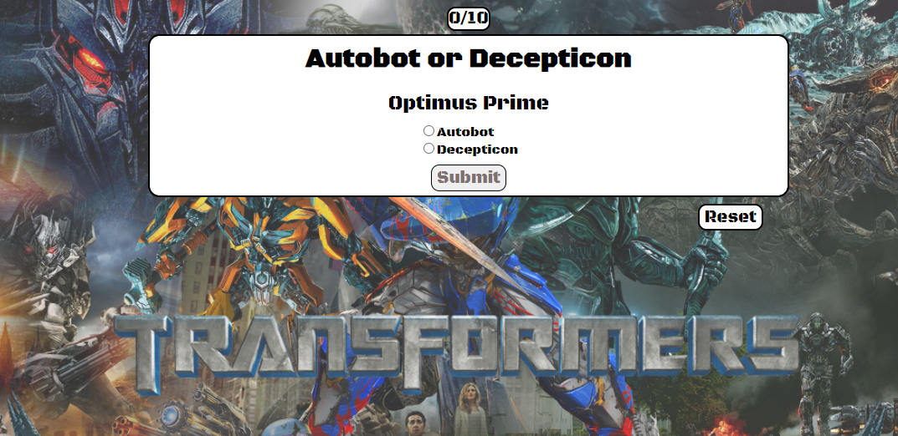

# PAPgame.github.io

                                                              Transformers Trivia!
--------------------------------------------------------------------------------------------------------------------------------------------------------------------------------------------
## Description:
Pachel Pederson created this Autobot or Decepticon trivia game 05/06/2021.
The purpose of this game is to test the users knowledge of all the major players from Cybertron.

## BriefExample:

 

# List of Features:
When I first started creating this game I was plannning to use a container for each question. I created all of my divs with all of my information in HTML, but then realized that is not how I wanted to do things. I had already spent almost two days on this code and was gutted to see it go! Honestly, I even cried a bit. After getting loads of help from David, Skyler and Jeremiah I was starting to feel a bit more comoftable with my code come Wednesday afternoon. I had moved all of my questions into objects in a transformers array in javascript. Created radio buttons in my HTML and had it styled just right. Thursday morning was when I decided I would show the player their score as they played and even propmt them with an alert if they were incorrect. After I felt comfortable with my scoring I created a reset button and an alert to end the game. 

# List of technologies used:
CSS
HTML
JavaScript

# Installation instructions:
https://papeders.github.io/PAPgame.github.io/

# Contribution guidelines:

My repository :
https://github.com/papeders/PAPgame.github.io

Also, let it be known that I used the following websites to help me set up my game:

https://stackoverflow.com/questions/13831601/disabling-and-enabling-a-html-input-button
https://www.javascripttutorial.net/javascript-dom/javascript-radio-button/